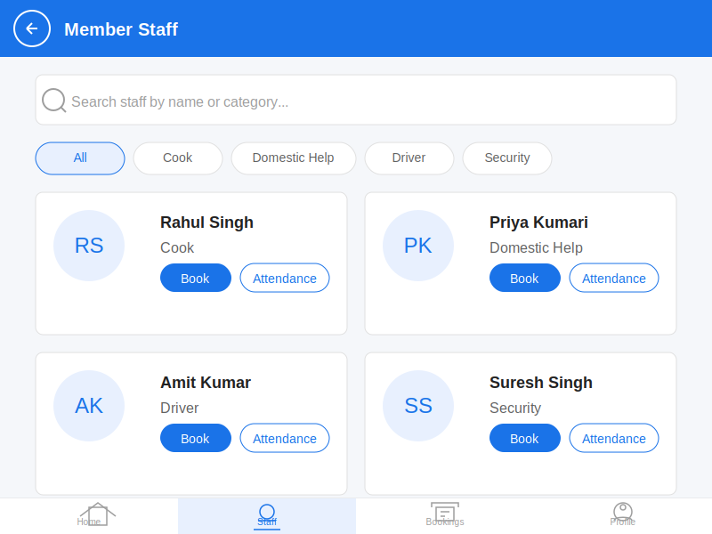
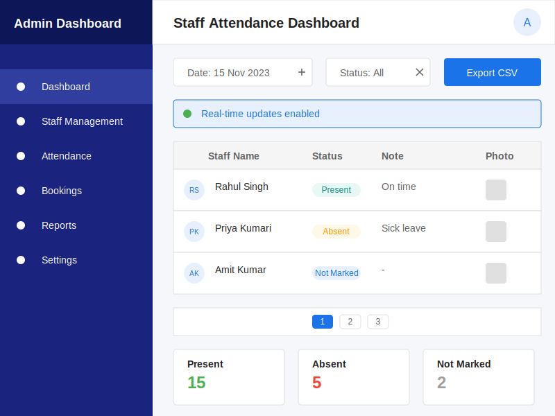

# Member Staff Module - Integration Guide

This guide provides detailed instructions for integrating the Member Staff module into the parent OneApp application.

## Module Screens

### Member Staff Landing Screen



#### Key Features

1. **Search Functionality**: Search bar to find staff by name or category
2. **Category Filters**: Quick filters for different staff categories (Cook, Domestic Help, Driver, Security)
3. **Staff Cards**: Visual cards showing staff information with profile pictures
4. **Action Buttons**: Direct access to booking and attendance tracking
5. **Bottom Navigation**: Easy navigation between different sections of the app

### Admin Dashboard Screen



#### Key Features

1. **Navigation Sidebar**: Quick access to different admin functions
2. **Date Selector**: View attendance for specific dates
3. **Status Filter**: Filter by attendance status (Present, Absent, Not Marked)
4. **Real-time Updates**: Indicator showing real-time data synchronization
5. **Staff Attendance Table**: Comprehensive view of staff attendance records
6. **Attendance Photos**: View photo proof of attendance
7. **Pagination**: Navigate through multiple pages of records
8. **Summary Cards**: Quick statistics showing attendance counts

### Attendance Tracking Screen


#### Key Features

1. **Monthly Calendar View**: Visual calendar showing the entire month
2. **Attendance Status Indicators**: Color-coded indicators showing attendance status for each day
   - Green: Present
   - Red: Absent
   - No indicator: Not marked
3. **Date Selection**: Ability to select a specific date to mark attendance
4. **Staff Information**: Display of staff details for the selected staff member
5. **Attendance Form**: Simple form to mark attendance as present or absent
6. **Photo Proof**: Option to take a photo as proof of attendance
7. **Submit Button**: Button to submit the attendance record

## Table of Contents

1. [Overview](#overview)
2. [Prerequisites](#prerequisites)
3. [Architecture](#architecture)
4. [Integration Steps](#integration-steps)
5. [Authentication Integration](#authentication-integration)
6. [API Integration](#api-integration)
7. [UI Integration](#ui-integration)
8. [Testing the Integration](#testing-the-integration)
9. [Troubleshooting](#troubleshooting)
10. [Appendix](#appendix)

## Overview

The Member Staff module is designed to be embedded within the OneApp as a micro-app. It provides functionality for:

- Staff verification (mobile verification, OTP, identity capture)
- Staff schedule management
- Member-staff assignments

This module is built with Flutter and connects to a Laravel API backend. It leverages the parent OneApp's authentication system and ensures that all API requests include the necessary member context information.

## Prerequisites

Before integrating the Member Staff module, ensure you have:

1. OneApp version 2.0 or higher
2. Flutter SDK 3.0 or higher
3. Access to the Member Staff module repository
4. Access to the Member Staff API backend
5. Authentication tokens from the parent OneApp

## Architecture

The Member Staff module follows a modular architecture that allows it to be embedded within the parent OneApp:

```
OneApp (Parent Application)
├── Authentication System
├── Navigation System
├── Core Services
└── Modules
    ├── Member Staff Module
    │   ├── API Client
    │   ├── Models
    │   ├── Screens
    │   ├── Widgets
    │   └── Services
    └── Other Modules
```

### Key Components

- **TokenManager**: Handles JWT token management and decoding
- **ApiClient**: Makes API requests with authentication and member context
- **MemberStaffModule**: Main entry point for the module
- **MemberStaffProvider**: Manages state for the module

## Integration Steps

### 1. Add the Module to Your Project

#### Option A: Using Git Submodule

```bash
# Add the Member Staff module as a submodule
git submodule add https://github.com/your-org/member-staff-flutter.git lib/modules/member_staff

# Update the submodule
git submodule update --init --recursive
```

#### Option B: Using Package Dependency

Add the Member Staff module to your `pubspec.yaml`:

```yaml
dependencies:
  member_staff:
    git:
      url: https://github.com/your-org/member-staff-flutter.git
      ref: main  # or specific tag/commit
```

Then run:

```bash
flutter pub get
```

### 2. Update Dependencies

Ensure your app has all the required dependencies:

```yaml
dependencies:
  flutter:
    sdk: flutter
  provider: ^6.0.5
  http: ^0.13.5
  flutter_secure_storage: ^8.0.0
  jwt_decoder: ^2.0.1
  image_picker: ^0.8.7
  intl: ^0.18.0
  # Add other dependencies as needed
```

### 3. Configure API Endpoint

Create a configuration file at `lib/config/api_config.dart`:

```dart
class ApiConfig {
  static const String baseUrl = 'https://api.oneapp.example.com/api';
  static const String memberStaffApiUrl = '$baseUrl/member-staff';
}
```

### 4. Register the Module

In your app's main file, register the Member Staff module:

```dart
import 'package:flutter/material.dart';
import 'package:provider/provider.dart';
import 'package:member_staff/src/features/member_staff/member_staff_module.dart';
import 'package:member_staff/src/core/network/api_client.dart';
import 'package:member_staff/src/features/member_staff/providers/member_staff_provider.dart';
import 'package:member_staff/src/features/member_staff/api/member_staff_api.dart';
import 'config/api_config.dart';

void main() {
  runApp(MyApp());
}

class MyApp extends StatelessWidget {
  @override
  Widget build(BuildContext context) {
    return MultiProvider(
      providers: [
        // Your existing providers

        // Member Staff module providers
        Provider<ApiClient>(
          create: (_) => ApiClient(baseUrl: ApiConfig.memberStaffApiUrl),
        ),
        Provider<MemberStaffApi>(
          create: (context) => MemberStaffApi(
            apiClient: Provider.of<ApiClient>(context, listen: false),
          ),
        ),
        ChangeNotifierProvider<MemberStaffProvider>(
          create: (context) => MemberStaffProvider(
            api: Provider.of<MemberStaffApi>(context, listen: false),
          ),
        ),
      ],
      child: MaterialApp(
        // Your app configuration
        home: HomeScreen(),
      ),
    );
  }
}
```

## Authentication Integration

The Member Staff module relies on the parent OneApp's authentication system. You need to pass the authentication token to the module.

### 1. Pass Authentication Token

When navigating to the Member Staff module, pass the authentication token:

```dart
import 'package:member_staff/src/core/auth/token_manager.dart';
import 'package:member_staff/src/features/member_staff/member_staff_module.dart';

Future<void> navigateToMemberStaffModule(BuildContext context) async {
  // Get the authentication token from your app
  final String authToken = await yourAuthService.getToken();

  // Save the token to the Member Staff module's TokenManager
  await TokenManager.saveAuthToken(authToken);

  // Navigate to the Member Staff module
  Navigator.push(
    context,
    MaterialPageRoute(
      builder: (context) => const MemberStaffModule(
        baseUrl: ApiConfig.memberStaffApiUrl,
      ),
    ),
  );
}
```

### 2. Handle Token Refresh

Implement token refresh logic to ensure the Member Staff module always has a valid token:

```dart
// In your app's authentication service
Future<void> refreshToken() async {
  // Your token refresh logic
  final String newToken = await yourAuthService.refreshToken();

  // Update the token in the Member Staff module
  await TokenManager.saveAuthToken(newToken);
}
```

### 3. Decode and Use Member Context from JWT

The Member Staff module needs to extract member context information from the JWT token:

```dart
import 'package:jwt_decoder/jwt_decoder.dart';

class MemberContextExtractor {
  static Map<String, dynamic> extractMemberContext(String token) {
    try {
      final Map<String, dynamic> decodedToken = JwtDecoder.decode(token);

      return {
        'member_id': decodedToken['member_id'],
        'unit_id': decodedToken['unit_id'],
        'company_id': decodedToken['company_id'],
      };
    } catch (e) {
      print('Error decoding JWT token: $e');
      return {};
    }
  }
}
```

Use this context in API requests:

```dart
class ApiClient {
  final String baseUrl;
  final Future<String> Function() tokenProvider;

  ApiClient({required this.baseUrl, required this.tokenProvider});

  Future<http.Response> post(String endpoint, Map<String, dynamic> data) async {
    final token = await tokenProvider();
    final memberContext = MemberContextExtractor.extractMemberContext(token);

    // Inject member context into all requests
    final requestData = {
      ...data,
      ...memberContext,
    };

    return http.post(
      Uri.parse('$baseUrl/$endpoint'),
      headers: {
        'Content-Type': 'application/json',
        'Authorization': 'Bearer $token',
      },
      body: jsonEncode(requestData),
    );
  }
}
```

## API Integration

The Member Staff module communicates with its own API backend. You need to ensure this API is properly deployed and accessible.

### 1. API Configuration

Configure your API gateway or proxy to route requests to the Member Staff API:

```
/api/member-staff/* -> Member Staff API
```

### 2. API Authentication

Ensure your API gateway forwards authentication headers to the Member Staff API. The Member Staff module expects the OneApp JWT token to be passed in the Authorization header.

#### JWT Token Structure

The OneApp JWT token should contain the following claims:

```json
{
  "member_id": "00000000-0000-0000-0000-000000000001",
  "unit_id": "00000000-0000-0000-0000-000000000002",
  "company_id": "8454",
  "name": "John Doe",
  "email": "john.doe@example.com",
  "exp": 1690464000
}
```

#### Token Verification Middleware

The Member Staff API uses a middleware to verify the JWT token and extract the member context:

```php
// app/Http/Middleware/VerifyJwtToken.php
public function handle(Request $request, Closure $next)
{
    try {
        $token = $request->bearerToken();
        if (!$token) {
            return response()->json(['message' => 'Unauthorized'], 401);
        }

        // Verify token with OneApp's public key
        $decoded = JWT::decode($token, new Key(config('auth.jwt_public_key'), 'RS256'));

        // Store member context in request for later use
        $request->merge([
            'member_context' => [
                'member_id' => $decoded->member_id,
                'unit_id' => $decoded->unit_id,
                'company_id' => $decoded->company_id
            ]
        ]);

        return $next($request);
    } catch (\Exception $e) {
        return response()->json(['message' => 'Invalid token'], 401);
    }
}
```

### 3. CORS Configuration

Configure CORS on the Member Staff API to allow requests from your OneApp domains:

```php
// In Laravel's cors.php config
return [
    'paths' => ['api/*'],
    'allowed_origins' => ['https://oneapp.example.com'],
    'allowed_methods' => ['*'],
    'allowed_headers' => ['*'],
    'exposed_headers' => [],
    'max_age' => 0,
    'supports_credentials' => false,
];
```

### 4. Database Connection

The Member Staff module needs to connect to the existing OneApp MySQL database. Configure the database connection in the Laravel backend:

```php
// config/database.php
'mysql' => [
    'driver' => 'mysql',
    'url' => env('DATABASE_URL'),
    'host' => env('DB_HOST', '127.0.0.1'),
    'port' => env('DB_PORT', '3306'),
    'database' => env('DB_DATABASE', 'oneapp_db'),
    'username' => env('DB_USERNAME', 'oneapp_user'),
    'password' => env('DB_PASSWORD', ''),
    'unix_socket' => env('DB_SOCKET', ''),
    'charset' => 'utf8mb4',
    'collation' => 'utf8mb4_unicode_ci',
    'prefix' => env('DB_PREFIX', ''),
    'prefix_indexes' => true,
    'strict' => true,
    'engine' => null,
    'options' => extension_loaded('pdo_mysql') ? array_filter([
        PDO::MYSQL_ATTR_SSL_CA => env('MYSQL_ATTR_SSL_CA'),
    ]) : [],
],
```

Update the `.env` file with the OneApp database credentials:

```
DB_CONNECTION=mysql
DB_HOST=your_mysql_host
DB_PORT=3306
DB_DATABASE=oneapp_db
DB_USERNAME=oneapp_user
DB_PASSWORD=your_password
DB_PREFIX=oneapp_  # If your OneApp uses table prefixes
```

### 5. Database Migrations

Run the Member Staff module migrations to create the necessary tables in the OneApp database:

```bash
php artisan migrate --path=database/migrations/member_staff
```

The migrations will create the following tables:

- `{prefix}staff` - Stores staff information
- `{prefix}time_slots` - Stores staff availability time slots
- `{prefix}member_staff_assignments` - Stores member-staff assignments
- `{prefix}member_staff_bookings` - Stores staff booking information
- `{prefix}booking_slots` - Stores individual booking time slots
- `{prefix}member_staff_attendance` - Stores staff attendance records

## UI Integration

### 1. Navigation

Add a navigation item to access the Member Staff module:

```dart
ListTile(
  leading: Icon(Icons.people),
  title: Text('Member Staff'),
  onTap: () => navigateToMemberStaffModule(context),
),
```

### 2. Theme Integration

To ensure the Member Staff module matches your app's theme, provide a theme when navigating:

```dart
Navigator.push(
  context,
  MaterialPageRoute(
    builder: (context) => Theme(
      data: Theme.of(context),
      child: const MemberStaffModule(
        baseUrl: ApiConfig.memberStaffApiUrl,
      ),
    ),
  ),
);
```

### 3. Deep Linking

Set up deep linking to the Member Staff module:

```dart
// In your app's route handling
if (route.startsWith('/member-staff')) {
  // Extract any parameters if needed
  final params = extractParams(route);

  // Navigate to the Member Staff module
  navigateToMemberStaffModule(context, params);
  return true;
}
```

## Testing the Integration

### 1. Authentication Testing

Test that authentication tokens are correctly passed to the Member Staff module:

```dart
// Test code
test('Authentication token is passed correctly', () async {
  final authToken = 'test_token';
  await TokenManager.saveAuthToken(authToken);
  final retrievedToken = await TokenManager.getAuthToken();
  expect(retrievedToken, equals(authToken));
});
```

### 2. API Testing

Test that API requests include the correct authentication and member context:

```dart
// Test code
test('API requests include authentication and member context', () async {
  final apiClient = ApiClient(baseUrl: 'https://api.example.com');
  final request = await apiClient.prepareRequest('GET', 'endpoint');

  expect(request.headers['Authorization'], startsWith('Bearer '));

  final body = jsonDecode(request.body);
  expect(body, contains('member_id'));
  expect(body, contains('unit_id'));
  expect(body, contains('company_id'));
});
```

### 3. Database Connection Testing

Test that the Member Staff module correctly connects to the OneApp database:

```dart
// Test code using Laravel's testing framework
class DatabaseConnectionTest extends TestCase
{
    public function testDatabaseConnection()
    {
        // Test connection to the OneApp database
        $this->assertTrue(DB::connection()->getDatabaseName() === 'oneapp_db');

        // Test that we can query the staff table
        $staff = DB::table('staff')->first();
        $this->assertNotNull($staff);
    }

    public function testMemberStaffTables()
    {
        // Test that all required tables exist
        $tables = [
            'staff',
            'time_slots',
            'member_staff_assignments',
            'member_staff_bookings',
            'booking_slots',
            'member_staff_attendance'
        ];

        foreach ($tables as $table) {
            $this->assertTrue(Schema::hasTable($table));
        }
    }
}
```

### 4. UI Testing

Test that the Member Staff module UI is correctly displayed within your app:

```dart
// Test code
testWidgets('Member Staff module UI is displayed', (WidgetTester tester) async {
  await tester.pumpWidget(
    MaterialApp(
      home: MemberStaffModule(baseUrl: 'https://api.example.com'),
    ),
  );

  expect(find.text('Verify Staff Member'), findsOneWidget);
});
```

### 5. End-to-End Testing

Test the complete flow from the OneApp to the Member Staff module and back:

```dart
testWidgets('End-to-end integration test', (WidgetTester tester) async {
  // Set up a mock authentication service
  final mockAuthService = MockAuthService();
  when(mockAuthService.getToken()).thenAnswer((_) async => 'valid_jwt_token');

  // Build the app with the mock auth service
  await tester.pumpWidget(
    MultiProvider(
      providers: [
        Provider<AuthService>.value(value: mockAuthService),
      ],
      child: MyApp(),
    ),
  );

  // Navigate to the Member Staff module
  await tester.tap(find.text('Member Staff'));
  await tester.pumpAndSettle();

  // Verify that the Member Staff module is displayed
  expect(find.text('Staff Management'), findsOneWidget);

  // Test a complete flow (e.g., booking a staff member)
  await tester.tap(find.text('Search Staff'));
  await tester.pumpAndSettle();

  // Enter search criteria
  await tester.enterText(find.byType(TextField).first, 'Cook');
  await tester.tap(find.text('Search'));
  await tester.pumpAndSettle();

  // Verify search results
  expect(find.text('Available Staff'), findsOneWidget);
});
```

## Troubleshooting

### Common Issues

#### 1. Authentication Errors

**Symptom**: API requests return 401 Unauthorized errors.

**Solution**:
- Verify that the authentication token is correctly passed to the Member Staff module
- Check that the token is valid and not expired
- Ensure the token includes the required member context
- Verify that the JWT token structure matches what the API expects
- Check that the public key used for JWT verification is correct

#### 2. API Connection Issues

**Symptom**: API requests fail with connection errors.

**Solution**:
- Verify that the API endpoint is correctly configured
- Check network connectivity
- Ensure the API server is running and accessible
- Check that the API routes are correctly registered in Laravel

#### 3. Database Connection Issues

**Symptom**: Database queries fail or return unexpected results.

**Solution**:
- Verify that the database credentials in the `.env` file are correct
- Check that the database user has the necessary permissions
- Ensure that the required tables exist in the database
- Check for table prefix issues if the OneApp uses table prefixes
- Run migrations to ensure all tables are created correctly

#### 4. Member Context Issues

**Symptom**: API requests succeed but return incorrect data or unauthorized errors.

**Solution**:
- Verify that the JWT token contains the correct member context (member_id, unit_id, company_id)
- Check that the member context is correctly extracted and passed to API requests
- Ensure that the member has the necessary permissions in the database
- Check that the middleware correctly extracts and stores the member context

#### 5. UI Rendering Issues

**Symptom**: UI elements are not displayed correctly or are misaligned.

**Solution**:
- Verify that the theme is correctly passed to the Member Staff module
- Check for any conflicting styles or themes
- Ensure the parent app and the Member Staff module use compatible Flutter versions
- Check for any missing assets or resources

### Logging

Enable detailed logging to troubleshoot integration issues:

```dart
// In your app's main.dart
void main() {
  // Enable detailed logging
  Logging.enableDetailedLogs = true;

  runApp(MyApp());
}
```

## Appendix

### A. Module Structure

```
lib/
├── src/
│   ├── core/
│   │   ├── auth/
│   │   │   └── token_manager.dart
│   │   ├── network/
│   │   │   └── api_client.dart
│   │   └── exceptions/
│   │       └── api_exception.dart
│   └── features/
│       └── member_staff/
│           ├── api/
│           │   └── member_staff_api.dart
│           ├── models/
│           │   ├── staff.dart
│           │   ├── time_slot.dart
│           │   └── schedule.dart
│           ├── providers/
│           │   └── member_staff_provider.dart
│           ├── screens/
│           │   └── verification_flow/
│           │       ├── mobile_verification_screen.dart
│           │       ├── otp_verification_screen.dart
│           │       ├── identity_form_screen.dart
│           │       └── verification_success_screen.dart
│           ├── widgets/
│           │   └── logged_in_member_info.dart
│           └── member_staff_module.dart
```

### B. API Endpoints

| Endpoint | Method | Description |
|----------|--------|-------------|
| /api/staff/check | GET | Check if staff exists |
| /api/staff/send-otp | POST | Send OTP to mobile |
| /api/staff/verify-otp | POST | Verify OTP |
| /api/staff/{id}/verify | PUT | Verify staff identity |
| /api/staff/{staffId}/schedule | GET | Get staff schedule |
| /api/staff/{staffId}/schedule | PUT | Update staff schedule |
| /api/staff/{staffId}/schedule/slots | POST | Add time slot |
| /api/staff/{staffId}/schedule/slots | PUT | Update time slot |
| /api/staff/{staffId}/schedule/slots | DELETE | Remove time slot |
| /api/members/{memberId}/staff | GET | Get member staff |
| /api/member-staff/assign | POST | Assign staff to member |
| /api/member-staff/unassign | POST | Unassign staff from member |

### C. Required Permissions

The Member Staff module requires the following permissions:

- Camera access (for taking staff photos)
- Internet access (for API communication)
- Secure storage access (for token storage)

### D. Version Compatibility

| Component | Minimum Version | Recommended Version |
|-----------|-----------------|---------------------|
| Flutter | 2.10.0 | 3.10.0 or higher |
| Dart | 2.16.0 | 3.0.0 or higher |
| OneApp | 2.0.0 | 2.5.0 or higher |
| Android | API 21 (Android 5.0) | API 33 (Android 13) |
| iOS | iOS 11.0 | iOS 16.0 or higher |
