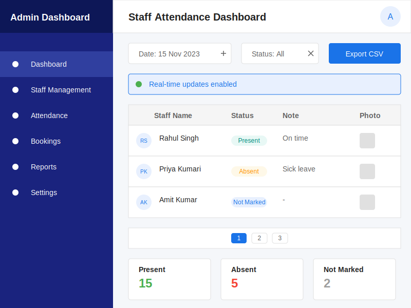

# Member Staff Admin Dashboard Screen

## Key Features

1. **Navigation Sidebar**: Quick access to different admin functions
2. **Date Selector**: View attendance for specific dates
3. **Status Filter**: Filter by attendance status (Present, Absent, Not Marked)
4. **Real-time Updates**: Indicator showing real-time data synchronization
5. **Staff Attendance Table**: Comprehensive view of staff attendance records
6. **Attendance Photos**: View photo proof of attendance
7. **Pagination**: Navigate through multiple pages of records
8. **Summary Cards**: Quick statistics showing attendance counts

## User Flow

1. Admin logs in to the dashboard
2. The dashboard displays current day's attendance by default
3. Admin can select a different date or filter by status
4. Real-time updates appear automatically as staff mark attendance
5. Admin can export data to CSV for reporting
6. Summary cards provide at-a-glance statistics

## Design Elements

- **Color Coding**: Different colors for different attendance statuses
- **Responsive Layout**: Adapts to different screen sizes
- **Intuitive Navigation**: Clear sidebar for easy access to different features
- **Data Visualization**: Summary cards for quick insights
