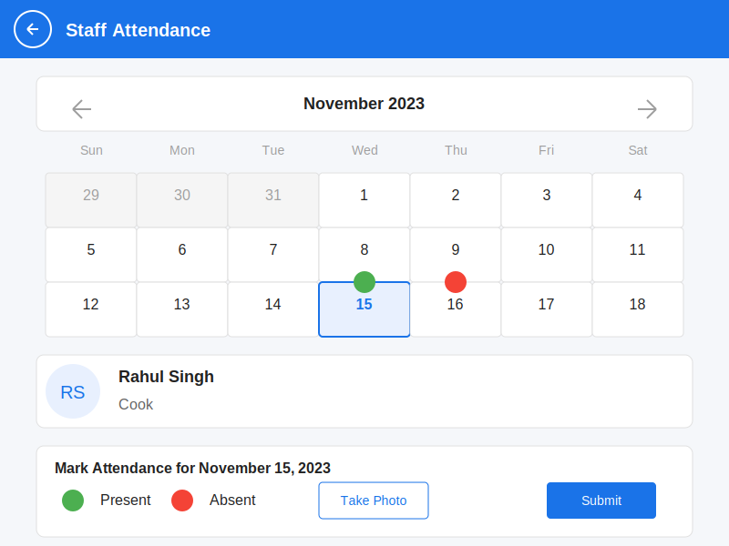

# Member Staff Attendance Tracking Screen

## Key Features

1. **Monthly Calendar View**: Visual calendar showing the entire month
2. **Attendance Status Indicators**: Color-coded indicators showing attendance status for each day
   - Green: Present
   - Red: Absent
   - No indicator: Not marked
3. **Date Selection**: Ability to select a specific date to mark attendance
4. **Staff Information**: Display of staff details for the selected staff member
5. **Attendance Form**: Simple form to mark attendance as present or absent
6. **Photo Proof**: Option to take a photo as proof of attendance
7. **Submit Button**: Button to submit the attendance record

## User Flow

1. User navigates to the Staff Attendance screen from the Member Staff module
2. The calendar view displays the current month with attendance status indicators
3. User selects a date to mark or update attendance
4. User marks the staff as present or absent
5. If present, user can take a photo as proof
6. User submits the attendance record
7. The calendar updates to show the new attendance status

## Design Elements

- **Calendar Layout**: Clean, organized monthly view
- **Color Coding**: Intuitive color indicators for attendance status
- **Selected Date Highlight**: Clear visual indication of the selected date
- **Simple Form**: Straightforward attendance marking options
