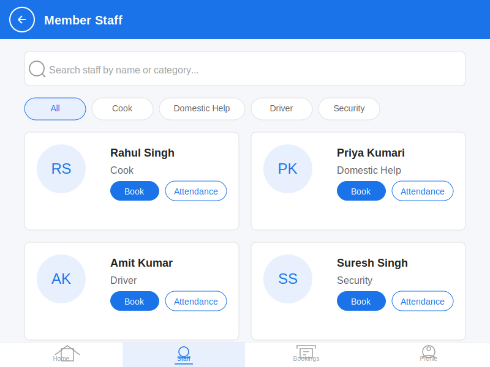

# Member Staff Module Landing Screen

## Key Features

1. **Search Functionality**: Search bar to find staff by name or category
2. **Category Filters**: Quick filters for different staff categories (Cook, Domestic Help, Driver, Security)
3. **Staff Cards**: Visual cards showing staff information with profile pictures
4. **Action Buttons**: Direct access to booking and attendance tracking
5. **Bottom Navigation**: Easy navigation between different sections of the app

## User Flow

1. User navigates to the Member Staff module from the OneApp main menu
2. The landing screen displays all available staff members
3. User can search for specific staff or filter by category
4. From each staff card, user can:
   - Book the staff member for specific dates/times
   - Track attendance for the staff member

## Design Elements

- **Color Scheme**: Uses OneApp's primary colors for consistency
- **Card Layout**: Clean, organized presentation of staff information
- **Responsive Design**: Adapts to different screen sizes
- **Intuitive Navigation**: Clear bottom navigation bar for easy access to different features
